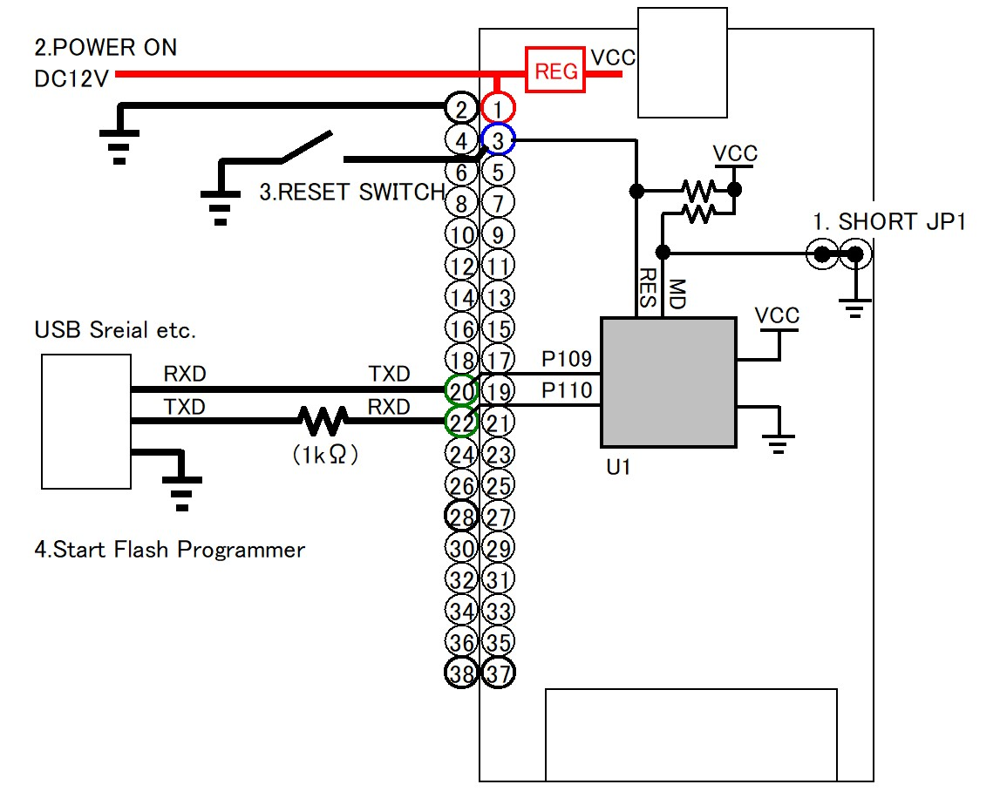
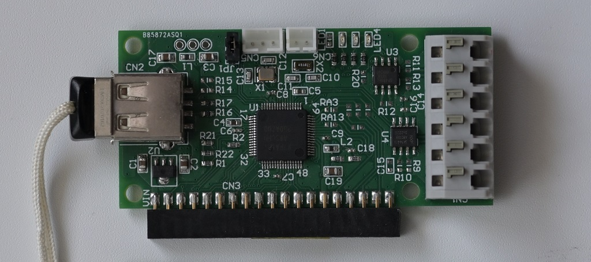
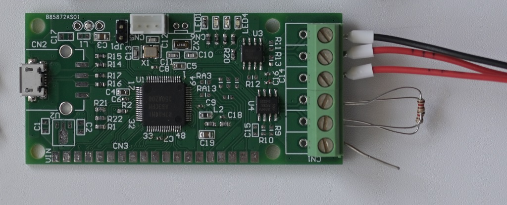

# 多機能マイコンボード
## 概要
- 手ごろな価格で入手でき、高性能で多機能なルネサス社マイコンRA4M1(R7FA4M1AB3CFM)
- USBホストまたはUSBファンクション機能をオンボードで使用可能
- RS485をオンボードで使用可能
- CANをオンボードで使用可能
- マイコン内蔵の豊富なアナログ機能をオンボードで使用可能
- 多数のマイコンコネクタを通して端子に外部からアクセス可能

# 使用法
## 書込み
接続図

手順  
1. JP1をショート(MD端子=LOW)
2. 電源ON
3. RES端子をLOWからHIに(図では外部リセットボタン)
4. Renesas Flash Programmerをスタート

## 実装例
外部からDC12V供給、USBホスト

USBバスパワー

## versatile functional control board using renesae RA4M1 microcontroller.
- High performance and versatile but low cost microcontroller(R7FA4M1AB3CFM)
- on board USB Host or Function
- on board RS485
- on board CAN
- on chip analog functions are accessed by on board configuration
- Many pins accessible for use from outside.
